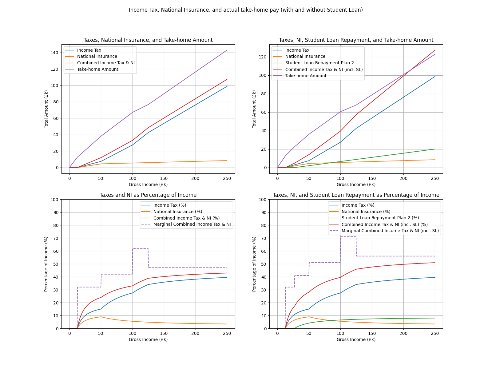
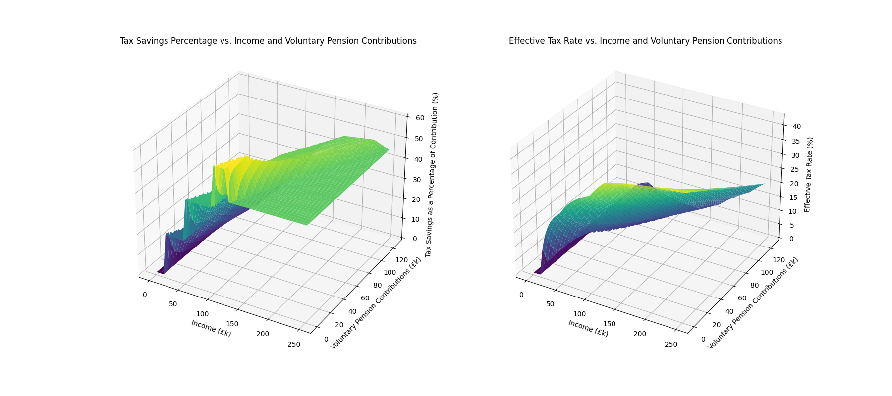
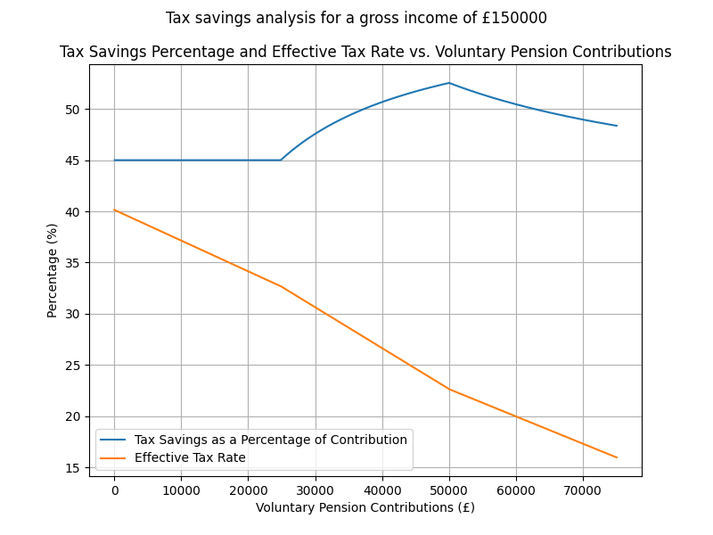

# Project deprecated

This project is now deprecated and superseded by [cooltaxtool](https://github.com/wozniakpawel/cooltaxtool)

# UK-Tax-Visualizer

This Python script is designed to help individuals in the UK understand and optimize their tax situation. It provides detailed tax breakdowns for a specified gross income and allows you to explore the effects of voluntary pension contributions on your tax savings.

## Prerequisites

You'll need to have Python 3 installed on your machine. You can download it from the [official Python website](https://www.python.org/downloads/).

## Installation

1. Clone the repository or download it as a ZIP file.

`git clone https://github.com/wozniakpawel/UK-Tax-Visualizer.git`

2. Navigate to the repository's root directory.

`cd UK-Tax-Visualizer`

3. Install the required Python modules using pip.

`pip install -r requirements.txt`

## Usage

### Overview mode
To get a general idea about taxes in the UK without providing an annual income, simply run the script without any arguments:

`python uk_tax_23-24.py`

This will display graphs that showcase the general landscape of the UK tax system in the 2023-2024 tax year.

If you don't provide command-line arguments, the script will also generate the following graphs:

1. Income Tax, National Insurance, and actual take-home pay (with and without Student Loan)
This graph shows how various deductions (Income Tax, National Insurance, Student Loan Repayments) behave across the salary range and how they affect the actual take-home amount. Left hand-side graphs don't include Student Loan Repayments, right hand-side graphs do.



2. Tax Savings Percentage and Effective Tax Rate vs. Income and Voluntary Pension Contributions (3D plot)
This 3D plot shows the tax savings percentage and the effective tax rate as functions of income and voluntary pension contributions. It gives you an idea on what salary ranges might benefit the most from voluntary pension contributions.



### Breakdown for a specific gross income
To calculate the tax breakdown for a specific gross income, provide the income as a command line argument:

`python uk_tax_23-24.py <your_annual_income>`

Replace <your_annual_income> with your actual annual income in GBP. For example, to calculate the tax breakdown for a salary of £150,000, run:

`python uk_tax_23-24.py 150000`

You should see an output similar to this:

```
With student loan:
 Gross Income: £150000.00
 Pre-tax Pension Contributions: £0.00
 Voluntary Pension Contributions: £0.00
 Adjusted Gross Income: £150000.00
 Personal Allowance: £0.00
 Taxable Income: £150000.00
 Income Tax: £53703.0
   20% Rate: £7540.00
   40% Rate: £34976.00
   45% Rate: £11187.00
 National Insurance: £6518.60
 Student Loan Repayment Plan 2: £11043.45
 Combined Taxes: £71265.05
 Take-home Amount: £78734.95

Without student loan:
 Gross Income: £150000.00
 Pre-tax Pension Contributions: £0.00
 Voluntary Pension Contributions: £0.00
 Adjusted Gross Income: £150000.00
 Personal Allowance: £0.00
 Taxable Income: £150000.00
 Income Tax: £53703.0
   20% Rate: £7540.00
   40% Rate: £34976.00
   45% Rate: £11187.00
 National Insurance: £6518.60
 Combined Taxes: £60221.60
 Take-home Amount: £89778.40
```

Providing annual income will also generate a graph showing tax savings as a percentage of voluntary pension contributions and the effective tax rate versus the voluntary pension contributions. It may give you an idea on what is the best strategy for making the most out of your pension contributions.



# Modifying the Script

You can customize the script by modifying the tax year-specific variables at the top, such as personal allowance, income tax rates, and national insurance thresholds. You should be able to find the exact numbers for a given tax year on the HMRC website.

You can also adjust the salary range used for generating graphs by modifying the salary_top_range variable.

# License

This project is licensed under the MIT License.
